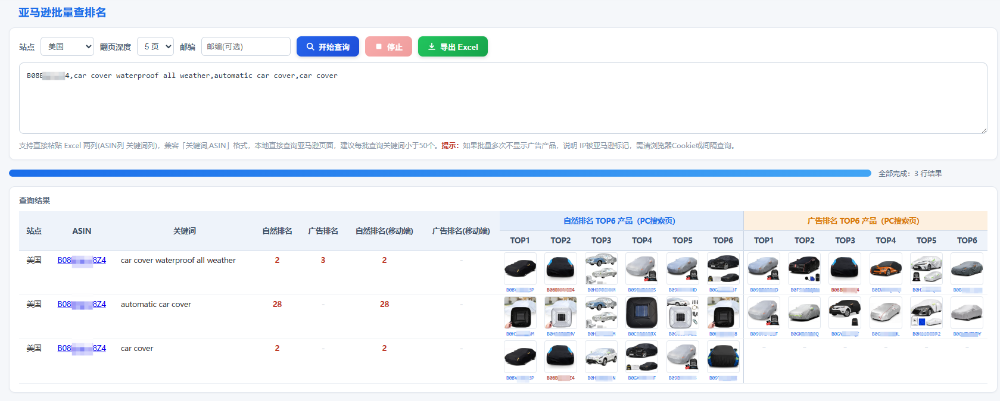

# 亚马逊批量查排名（Amazon Bulk Rank Checker）

Chrome 扩展：批量查询 ASIN 在亚马逊搜索结果中的**自然排名**与**广告排名（SP 广告）**，电脑端 + 移动端双端查询，行内展示关键词自然排名 TOP6 与广告排名 TOP6 产品，支持一键导出 Excel。

纯本地自用工具：所有请求直接发往亚马逊官方页面，不经过任何第三方服务器，无数据上报。

## 功能特性

- **批量查询**：一次可粘贴多组 `ASIN + 关键词`（Tab / 空格 / 中英文逗号分隔均可），自动展开为任务队列并发执行
- **双端排名**：同一关键词同时查询电脑端（PC）与移动端（Mobile）排名
- **自然排名 TOP6 / 广告排名 TOP6**：每个关键词展示搜索结果前 6 个自然位与前 6 个广告位产品（缩略图 + ASIN），命中的产品高亮
- **广告识别**：多维判定（赞助标签 / data-ad-id / aria-label / 组件类型 / 老版卡片类名 / 多语言文本正则），覆盖 SP 广告的各种渲染形态
- **跨页累计**：目标 ASIN 未在第 1 页命中时自动翻页（最多 5 页），排名按前页累计
- **一键导出**：结果导出为 Excel（xlsx），包含 19 列：站点 / ASIN / 关键词 / PC 自然·广告排名 / Mobile 自然·广告排名 / TOP1-6 / AD-TOP1-6
- **反爬节奏**：并发 3-5 随机、任务间隔 700-2200ms 随机抖动、基础版检测自动重试（1.5s/3s/5s 递增）、任务级失败重试（最多 3 次）
- **邮编设置**：可选填美国邮编，自动设置亚马逊配送地址，使搜索结果与浏览器内所见一致
- **多站点**：支持美国 / 加拿大 / 英国 / 德国 / 法国 / 西班牙 / 意大利 / 日本 / 澳大利亚 / 巴西 / 墨西哥 / 土耳其 / 荷兰 / 印度 14 个亚马逊站点

## 界面预览



> 上图：同时查询 3 组关键词，展示 PC 端自然排名、广告排名、移动端排名，以及自然排名 TOP6 与广告排名 TOP6 产品缩略图。

## 排名口径（与 Helium10 / SellerSprite 对齐）

- **自然排名**：自然位专用序号——广告位不占自然序号，仅在非广告卡片间累计
- **广告排名**：广告位序号——第 N 个广告位即排名 N
- **命中规则**：仅自然位命中才算命中并停止翻页；若目标在第 1 页只有广告位，继续翻页寻找自然位
- **跨页累计**：翻页命中的排名 = 前面所有页的自然位 / 广告位总数 + 本页页内序号

> 说明：仅检查 **SP 广告（Sponsored Products）**；SB 广告（品牌横幅 / 轮播 "Popular Shopping Ideas" / "From frequently shopped brands"、SBV 品牌视频）不做排名检查，其卡片位于轮播容器内、不属于搜索结果卡片，天然不参与解析。

## 安装方法

1. 下载 / 克隆本仓库
2. 打开 Chrome，进入 `chrome://extensions/`
3. 开启右上角「开发者模式」
4. 点击「加载已解压的扩展程序」，选择本项目目录（含 `manifest.json` 的目录）
5. 点击工具栏图标打开批量查询页面

> 无需登录、无后台服务器，数据仅在你的浏览器与亚马逊之间传输。

## 使用方法

在输入框中粘贴查询任务，每行一组，支持以下格式：

```
B0XXXXXXXXXX\t关键词
B0XXXXXXXXXX 关键词
B0XXXXXXXXXX，关键词1，关键词2
关键词，B0XXXXXXXXXX
```

- 一 ASIN 多关键词：关键词之间用英文或中文逗号分隔，自动展开为多条任务
- 行首可加站点覆盖（不填则用下拉框选择的站点）：`日本\tB0XXXXXXXXXX\t关键词`
- 可选：填写美国邮编，查询前自动设置配送地址
- 点击「开始查询」→ 等待完成 → 「导出 Excel」

## 版本历史

| 版本 | 说明 |
|---|---|
| v1.1.17 | 修复移动端排名与 PC 完全相同的问题：扩展 XHR 无法设置 User-Agent（浏览器禁止头，此前移动端实际一直发桌面 UA）；改用 declarativeNetRequest 会话规则在 network 层替换移动端请求的 UA |
| v1.1.16 | 修复广告漏抓根因：亚马逊对高频搜索请求做请求级随机降级（部分请求返回无广告基础版）。删除 Cache-Control/Pragma no-cache 头；删除"目标 ASIN 不在即重试"误判（目标无排名时广告 TOP6 照常列出）；基础版重试增至 4 次、间隔 5s/10s/15s/20s |
| v1.1.15 | 修复浏览器报错 "Refused to set unsafe header"（移除 Sec-Fetch 系列等浏览器禁止手动设置的请求头）；明确仅检查 SP 广告，SB/SBV 广告不做排名检查 |
| v1.1.14 | 任务级失败重试：网络错误 / 超时 / 验证码时整条任务重跑（最多 3 次，间隔递增随机） |
| v1.1.13 | 跨页排名累计（自然 / 广告均按前页总数偏移）；补充老版广告卡片类名识别 |
| v1.1.12 | 反爬节奏随机化：并发 3~5 随机、间隔 700~2200ms 随机 |
| v1.1.8 | 完整化浏览器请求头；基础版（去广告版）判定与自动重试 |
| v1.1.6 | 排名口径与 Helium10 / SellerSprite 对齐：自然位专用序号、仅自然位命中停止翻页 |

## 技术说明

- 纯前端实现：`manifest.json`（MV3）+ `popup.html` + `popup.js` + 最小化 `background.js`
- 依赖本地 `jquery.min.js` 与 `xlsx.full.min.js`，无 CDN、无远程脚本
- 网络请求仅发往 `https://www.amazon.<域名>`，请求头模拟真实浏览器并保留浏览器 cookie 上下文
- 验证码 / 登录墙自动降级处理，不硬性中断

## 免责声明

本项目为个人自用的亚马逊运营辅助工具，仅用于个人学习与工作研究。请合理控制请求频率，遵守亚马逊服务条款与所在地区法律法规，因滥用导致的账号风险由使用者自行承担。
